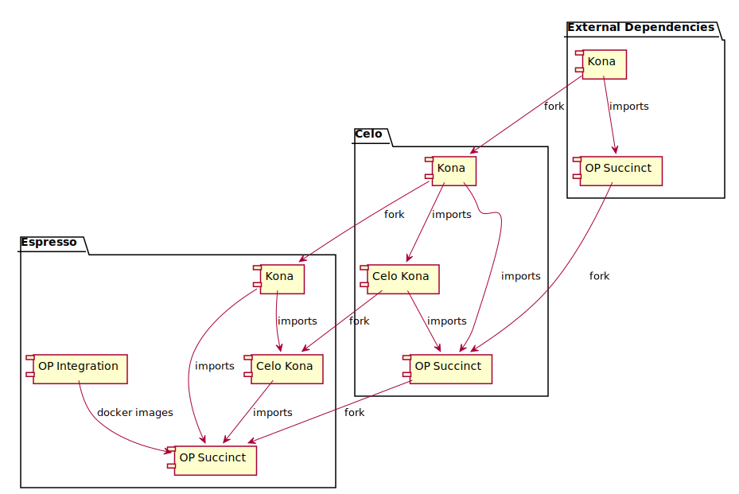

# Optimism Espresso Integration

Notes:
* For deployment configuration, read `README_ESPRESSO_DEPLOY_CONFIG.md`.
* For code sync with upstreams, read `README_ESPRESSO_CODE_SYNC_PROCEDURE.md`.

## Development environment

### Clone the repository and initialize the submodules

```console
> git clone git@github.com:EspressoSystems/optimism-espresso-integration.git
> git submodule update --init --recursive
```

### Nix shell

* Install nix following the instructions at https://nixos.org/download/

* Enter the nix shell of this project

```console
> nix develop .
```


### Configuring Docker

In order to download the docker images required by this project you may need to authenticate using a PAT.

Create a [Github Personal Access Token (PAT)](https://docs.github.com/en/authentication/keeping-your-account-and-data-secure/managing-your-personal-access-tokens#creating-a-personal-access-token-classic) following Creating a personal access token (classic).

Provide Docker with the PAT.

```console
> export CR_PAT=<your PAT>
> echo $CR_PAT | docker login ghcr.io -u USERNAME --password-stdin
```

Run docker as a non root user:
```console
> sudo add group docker
> sudo usermod -aG docker $USER
```

### Run the tests

Run the Espresso smoke tests:

```console
> just smoke-tests
```

Run the Espresso integration tests. Note, this can take up to 30min.

```console
> just espresso-tests
```

To run all the standard OP stack (w/o Espresso integration) tests (slow):

```console
> just tests
```

To run a subset of the tests above (fast):

```console
> just fast-tests
```

To run the devnet tests:
```console
> just devnet-tests
```

### Misc commands

In order to run the go linter do:
```console
just golint
```

Generate the bindings for the contracts:
```console
just gen-bindings
```

If some containers are still running (due to failed tests) run this command to stop and delete all the Espresso containers:

> just remove-containers


### Guide: Setting Up an Enclave-Enabled Nitro EC2 Instance

This guide explains how to prepare an enclave-enabled parent EC2 instance.

You can follow the official AWS Enclaves setup guide: https://docs.aws.amazon.com/enclaves/latest/user/getting-started.html.


#### Step-by-Step Instructions

##### 1. Launch the EC2 Instance

Use the AWS Management Console or AWS CLI to launch a new EC2 instance.

Make sure to:

- **Enable Enclaves**
		- In the CLI: set the `--enclave-options` flag to `true`
		- In the Console: select `Enabled` under the **Enclave** section

- **Use the following configuration:**
		- **Architecture:** x86_64
		- **AMI:** Amazon Linux 2023
		- **Instance Type:** `m6a.2xlarge`
		- **Volume Size:** 100 GB


##### 2. Connect to the Instance

Once the instance is running, connect to it via the AWS Console or CLI.
In practice, you will be provided a `key.pem` file, and you can connect like this:
```console
chmod 400 key.pem
ssh -i "key.pem" ec2-user@<aws_instance_dns>
```

Note that the command above can be found in the AWS Console by selecting the instance and clicking on the button "Connect".


##### 3. Install dependencies

* Nix
```console
sh <(curl --proto '=https' --tlsv1.2 -L https://nixos.org/nix/install) --daemon
source ~/.bashrc
```

* Git, Docker
```console
	sudo yum update
	sudo yum install git
	sudo yum install docker
	sudo usermod -a -G docker ec2-user
	sudo service docker start
	sudo chown ec2-user /var/run/docker.sock
```

* Nitro

These commands install the dependencies for, start the service related to and configures the enclave.

```console
sudo yum install -y aws-nitro-enclaves-cli-1.4.2
sudo systemctl stop nitro-enclaves-allocator.service || true
echo -e '---\nmemory_mib: 4096\ncpu_count: 2' | sudo tee /etc/nitro_enclaves/allocator.yaml
sudo systemctl start nitro-enclaves-allocator.service
```

* Clone repository and update submodules
```console
git clone https://github.com/EspressoSystems/optimism-espresso-integration.git
cd optimism-espresso-integration
git submodule update --init --recursive
```


* Enter the nix shell and run the enclave tests
```console
nix --extra-experimental-features "nix-command flakes" develop
just compile-contracts
just espresso-enclave-tests
```

#### Building, running and registering enclave images

`op-batcher/enclave-tools` provides a command-line utility for common operations on batcher enclave images.
Before using it, set your AWS instance as described in the guide above, then build the tool:

```console
cd op-batcher/
just enclave-tools
```

This should create `op-batcher/bin/enclave-tools` binary. You can run
```console
./op-batcher/bin/enclave-tools --help
```
to get information on available commands and flags.

##### Building a batcher image

To build a batcher enclave image, and tag it with specified tag:
```console
./op-batcher/bin/enclave-tools build --op-root ./ --tag op-batcher-enclave
```
On success this command will output PCR measurements of the enclave image, which can then be registered with BatchAuthenticator
contract.

##### Running a batcher image
To run enclave image built by the previous command:
```console
./op-batcher/bin/enclave-tools run --image op-batcher-enclave --args --argument-1,value-1,--argument-2,value-2
```
Arguments will be forwarded to the op-batcher

##### Registering a batcher image
To register PCR0 of the batcher enclave image built by the previous command:
```console
./op-batcher/bin/enclave-tools register --l1-url example.com:1234 --authenticator 0x123..def --private-key 0x123..def --pcr0 0x123..def
```
You will need to provide the L1 URL, the contract address of BatchAuthenticator, private key of L1 account used to deploy BatchAuthenticator and PCR0 obtained when building the image.

# Local Devnet

This section describes how to run a local devnet.

## Run Docker Compose

* Ensure that your Docker Compose, Engine, and plugins are up-to-date. Particularly, if the Docker
Compose version is `2.37.3` or the Docker Engine version is `27.4.0`, and the Docker build hangs,
you may need to upgrade the version.

* Enter the Nix shell in the repo root.
```console
nix develop
```

* Build the op-deployer. This step needs to be re-run if the op-deployer is modified.
```console
cd op-deployer
just
cd ../
```

* Build the contracts. This step needs to be re-run if the contracts are modified.
```console
just compile-contracts
```

* Go to the `espresso` directory.
```console
cd espresso
```

* Shut down all containers.
```console
docker compose down -v --remove-orphans
```

* Prepare OP contract allocations. Nix shell provides dependencies for the script. This step needs to be re-run only when the OP contracts are modified.
```console
./scripts/prepare-allocs.sh
```

* Build and start all services in the background.
```console
docker compose up --build -d
```
If you're on a machine with [AWS Nitro Enclaves enabled](#guide-setting-up-an-enclave-enabled-nitro-ec2-instance), use the `tee` profile instead to start the enclave batcher.
```console
COMPOSE_PROFILES=tee docker compose up --build -d
```

* Run the services and check the log.
```console
docker compose logs -f
```

## Investigate a Service

* Shut down all containers.
```console
docker compose down
```

* Build and start the specific service and check the log.
```console
docker compose up <service-name>
```

* If the environment variable setting is not picked up, pass it explicitly.
```console
docker compose --env-file .env up <service-name>
```

## Apply a Change

* In most cases, simply remove all containers and run commands as normal.
```console
docker compose down
```

* To start the project fresh, remove containers, volumes, and network, from this project.
```console
docker compose down -v
```

* To start the system fresh, remove all volumes.
```console
docker volume prune -a
```

* If encountering an issue related to outdated deployment files, remove those files before
restarting.
  * Go to the scripts directory.
  ```console
  cd espresso/scripts
  ```
  * Run the script.
  ```console
  ./cleanup.sh
  ```

* If you have changed OP contracts, you will have to start the devnet fresh and re-generate
  the genesis allocations by running `prepare-allocs.sh`


## Log monitoring
For a selection of important metrics to monitor for and corresponding log lines see `espresso/docs/metrics.md`

## Blockscout

Blockscout is a block explorer that reads from the sequencer node. It can be accessed at `http://localhost:3000`.


## Continuous Integration environment

### Running enclave tests in EC2

In order to run the tests for the enclave in EC2 via github actions one must create an AWS user that supports the following policy:

```json
{
	"Version": "2012-10-17",
	"Statement": [
		{
			"Effect": "Allow",
			"Action": [
				"ec2:AuthorizeSecurityGroupIngress",
				"ec2:RunInstances",
				"ec2:DescribeInstances",
				"ec2:TerminateInstances",
				"ec2:DescribeImages",
				"ec2:CreateTags",
				"ec2:DescribeSecurityGroups",
				"ec2:DescribeKeyPairs",
				"ec2:ImportKeyPair",
				"ec2:DescribeInstanceStatus"
			],
			"Resource": "*"
		}
	]
}
```

Currently, the github workflow in `.github/workflows/enclave.yaml` relies on AWS AMI with id `ami-0d259f3ae020af5f9` under `arn:aws:iam::324783324287`.
In order to refresh this AMI one needs to:
1. Create an AWS EC2 instance with the characteristics described in (see `.github/workflows/enclave.yaml` *Launch EC2 Instance* job).
2. Copy the script `espresso/scrips/enclave-prepare-ami.sh` in the EC2 instance (e.g. using scp) and run it.
3. [Export the AMI instance](https://docs.aws.amazon.com/toolkit-for-visual-studio/latest/user-guide/tkv-create-ami-from-instance.html).


# Celo Deployment

## Prepare for the Deployment
* Go to the scripts directory.
```console
cd espresso/scripts
```

## Prebuild Everything and Start All Services
Note that `l2-genesis` is expected to take around 2 minutes.
```console
./startup.sh
```
Or build and start the devnet with AWS Nitro Enclave as the TEE:
```console
USE_TEE=true ./startup.sh
```

## View Logs
There are 17 services in total, as listed in `logs.sh`. Run the script with the service name to
view its logs, e.g., `./logs.sh op-geth-sequencer`. Note that some service names can be replaced
by more convenient alias, e.g., `sequencer` instead of `op-node-sequencer`, but it is also suported
to use their full names.

The following are common commands to view the logs of critical services. Add `-tee` to the batcher
and the proposer services if running with the TEE.
```console
./logs.sh dev-node
./logs.sh sequencer
./logs.sh verifier
./logs.sh caff-node
./logs.sh batcher
./logs.sh proposer
```

## Shut Down All Services
```console
./shutdown.sh
```

# OP Succinct Lite dependencies

## Repositories

There are three types of repositories:
1. Kona implements the OP stack in Rust.
2. Celo-Kona is a wrapper of Kona with Celo specific changes.
3. OP Succinct: uses Kona and in our case also Celo-Kona in order to compute zk proofs for an OP rollup state change which is used in the challenger and proposer services.

The diagram below shows the relationship between the repositories.
Note importantly that OP Succinct (both in the case of Celo and Espresso) import not only Celo-Kona but also Kona.

The OP Succinct repository for Espresso generates using Github actions the docker images for the challenger and proposer services.




The table below is more specific regarding which branches of these repositories are used.


| External                                    |  Celo (rep/branch)                                                                                                                     | Espresso  (rep/branch)|
| :-------:                                   | :----:      | :------:|
| [kona](https://github.com/op-rs/kona)       | [Celo/kona](https://github.com/celo-org/kona)/[palango/kona-1.1.7-celo](https://github.com/celo-org/kona/tree/palango/kona-1.1.7-celo) | [Espresso/kona-celo-fork](https://github.com/EspressoSystems/kona-celo-fork)/[espresso-integration](https://github.com/EspressoSystems/kona-celo-fork/tree/espresso-integration) |
|                                             | [Celo/celo-kona](https://github.com/celo-org/celo-kona)/[main](https://github.com/celo-org/celo-kona/tree/main)  | [Espresso/celo-kona](https://github.com/EspressoSystems/celo-kona)/[espresso-integration](https://github.com/EspressoSystems/celo-kona/tree/espresso-integration) |
| [op-succinct](https://github.com/succinctlabs/op-succinct) | [Celo/op-succinct](https://github.com/celo-org/op-succinct)/[develop](https://github.com/celo-org/op-succinct/tree/develop) | [Espresso/op-succinct](https://github.com/EspressoSystems/op-succinct)/[espresso-integration](https://github.com/EspressoSystems/op-succinct/tree/espresso-integration)|


## Making a change to the derivation pipeline and propagating it to the relevant repositories.

In our setting changes to the derivation pipeline are made in the [kona](https://github.com/EspressoSystems/kona/tree/espresso-integration-v1.1.7) repository. Then these changes need to be propagated to the [celo-kona](https://github.com/EspressoSystems/celo-kona) and [op-succinct](https://github.com/EspressoSystems/op-succinct) repositories, generate the docker images for the challenger and proposer, and use these images in [optimism-espresso-integration](https://github.com/EspressoSystems/optimism-espresso-integration) as follows.


1. Merge your PR into [kona-celo-fork](https://github.com/EspressoSystems/kona-celo-fork/tree/espresso-integration). This PR contains some changes to the derivation pipeline. E.g.: [bfabb62](https://github.com/EspressoSystems/kona-celo-fork/commit/bfabb62754bc53317ecb93442bb09d347cd6aad9).

1. Create a PR against [celo-kona](https://github.com/EspressoSystems/celo-kona/tree/espresso-integration). This PR will edit the `Cargo.toml` file to reference the updated kona version, e.g: [a94b317](https://github.com/EspressoSystems/celo-kona/commit/a94b3172b1248a7cd650d692226c9d17b832eec9).

1. Create a PR in [op-succinct](https://github.com/EspressoSystems/op-succinct) and merge it into the branch [espresso-integration](https://github.com/EspressoSystems/op-succinct/tree/espresso-integration). This PR will edit the `Cargo.toml` file to reference the updated kona and celo-kona version, e.g: [41780a3](https://github.com/EspressoSystems/op-succinct/pull/3/commits/41780a339bb1e177281957fcfe0383dfa41eff15).

1. After running CI, check for new images of the succinct proposer and challenger services at
  * [containers/op-succinct-lite-proposer-celo](https://github.com/espressosystems/op-succinct/pkgs/container/op-succinct%2Fop-succinct-lite-proposer-celo)
  * [containers/op-succinct-lite-challenger-celo](https://github.com/espressosystems/op-succinct/pkgs/container/op-succinct%2Fop-succinct-lite-challenger-celo)
* These images should be updated in the [docker-compose.yml](https://github.com/EspressoSystems/optimism-espresso-integration/blob/b73ee83611418cd6ce3aa2d27e00881d9df7e012/espresso/docker-compose.yml) file when new versions are available. See for example [bd90858](https://github.com/EspressoSystems/optimism-espresso-integration/pull/293/commits/bd90858b0f871441785d4ac6437ff78b76d4b1f8).


Note that periodically we need to merge upstream changes in the `kona`, `celo-kona`, and `op-succinct` repositories to keep our integration branches up to date. This ensures that our custom modifications don't drift too far from the upstream codebase and that we can easily incorporate bug fixes and new features from the upstream projects.


# Testnet Migration

We are working on a set of scripts to handle the migration from a Celo Testnet to a version integrated with Espresso.

Some relevant documents:
* [Documentation of configuration parameters](docs/README_ESPRESSO_DEPLOY_CONFIG.md)
* [Celo Testnet Migration Guide](docs/CELO_TESTNET_MIGRATION.md) (WIP)

