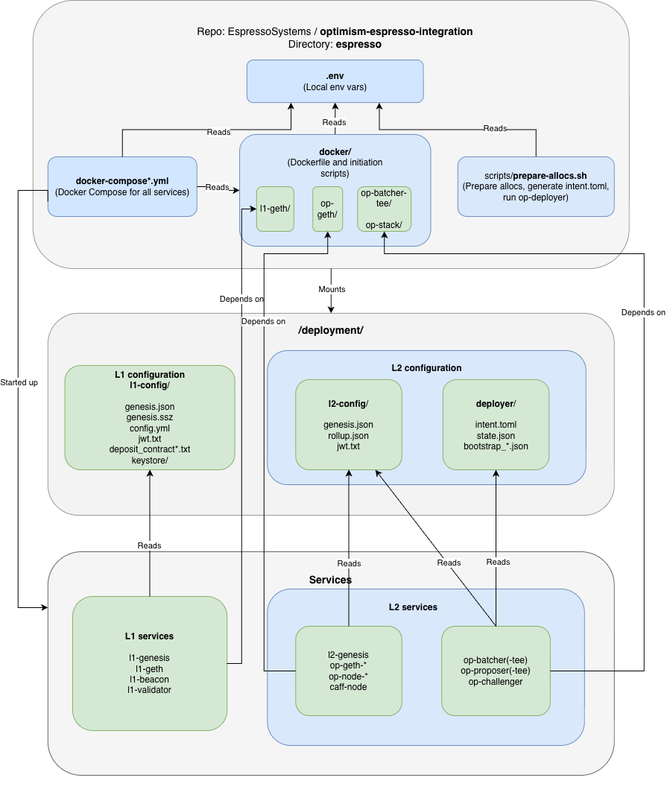

# Espresso Deployment Configuration

## Intentions

This document is intended to:

- Describe how the devnet is configured in [v0.4.0](https://github.com/EspressoSystems/optimism-espresso-integration/releases/tag/v0.4.0).
- Identify which files and services depend on which parameters.
- Show which components are likely to require updates during future migrations.
- Serve as a stable map when upgrading OP Stack or Celo versions, Espresso releases, chain parameters, contract addresses, or TEE settings.

## Scope

This document describes the configuration of:

- The Docker services defined in `/docker-compose.yml` and `/docker-compose-op-geth.yml`.
- L1 config in `/deployment/l1-config/*`.
- L2 config in `/deployment/l2-config/*`.
- Deployer artifacts in `/deployment/deployer/*`.

The layout in the `espresso` directory is:
```
deployment/
  deployer/                # Deployer outputs with contract addresses, registry bootstrap files, and intent specs
  l1-config/               # L1 chain config for the genesis, beacon, engine secret, and validator keys
  l2-config/               # L2 chain config for the genesis and engine secret
docker/                    # Dockerfile and initiation scripts
docker-compose.yml         # Docker Compose for all services
docker-compose-op-geth.yml # Docker Compose for the OP Geth services
```

## Configuration Pipeline



The general flow to start up a deployment is to:
1. Build the deployer and contracts.
2. Run `prepare_allocs.sh` to prepare contract allocations.
3. Build `docker-compose.yml` to mount deployment files.
4. Spin up services.

See [README_ESPRESSO.md#run-docker-compose](https://github.com/EspressoSystems/optimism-espresso-integration/blob/celo-integration-rebase-14.1/README_ESPRESSO.md#run-docker-compose) for details about manual steps, which are also included in the `startup.sh` script.

## L1 Configuration

### L1 Config Files

In `espresso/deployment/l1-config/`:

|  | Description | Service Dependents | Migration Impact |
| --- | --- | --- | --- |
| `genesis.json` | L1 execution genesis | `l1-geth` | Critical config: `chainId`, prefunded accounts in `alloc` |
| `genesis.ssz` | L1 consensus genesis | `l1-beacon`, `l1-validator` | Stable unless the L1 forks change |
| `config.yaml` | Beacon chain config | `l1-beacon`, `l1-validator` | Critical config: `*_FORK_VERSION`, `SECONDS_PER_SLOT`, `DEPOSIT_CONTRACT_ADDRESS`, `DEPOSIT_CHAIN_ID`, `DEPOSIT_NETWORK_ID` |
| `jwt.txt` | Engine API secret | `l1-beacon`, `l1-geth` | Stable, unless there’s a mismatch |
| `deposit_contract.txt`, `deposit_contract_block.txt` | Deposit contract metadata | `l1-genesis`, `l1-beacon`, `l1-validator` | Stable, unless the deposit contract changes |
| `keystore/` | Validator keys | `l1-validator` | Stable, unless inconsistent |

### L1 Services

In [espresso/docker-compose.yml](https://github.com/EspressoSystems/optimism-espresso-integration/blob/v0.4.0/espresso/docker-compose.yml):

|  | Relevant Inputs | Migration Sensitivity |
| --- | --- | --- |
| `l1-genesis` | `genesis.json`, `config.yaml`, `deposit_contract*.txt` | High, affected by genesis fields |
| `l1-geth` | `genesis.json`, `jwt.txt` | High, affected by genesis field changes |
| `l1-beacon` | `genesis.json`, `config.yaml`, `jwt.txt`, `deposit_contract*.txt` | High, affected by fork version changes |
| `l1-validator` | `genesis.json`, `config.yaml`, `jwt.txt`, `deposit_contract*.txt`, `keystore/` | Stable |

## L2 Configuration

### L2 Config Files

In `espresso/deployment/l2-config/`:

|  | Description | Service Dependents | Migration Impact |
| --- | --- | --- | --- |
| `genesis.json` | L2 execution genesis | `op-geth-*`, `l2-rollup`, `op-challenger` | Critical config: `chainId`, `timestamp`, prefunded accounts in `alloc`, parameters in`optimism` and `celo` |
| `rollup.json` | Rollup config | `op-node-*`, `caff-node`, `op-challenger` | Critical config: L1 RPC, L1 hash, L1 number, L2 hash, L2 number, L2 time, L2 chain ID |
| `jwt.txt` | Engine API secret | `op-node-*`, `caff-node` | Stable, unless inconsistent |

### L2 Deployer Files

In `espresso/deployment/deployer/`:

|  | Description | Service Dependents | Migration Impact |
| --- | --- | --- | --- |
| `bootstrap_*.json` | Bootstrap configuration for contract deployment | `l2-genesis` | Critical config: system contracts, registry fields |
| `intent.toml` | Deployment plan for contracts | `state.json` | Critical config: versions |
| `state.json` | Source of truth for all contract addresses | `op-batcher(-tee)` , `op-proposer(-tee)` , `op-challenger` | Critical config: `DisputeGameFactoryProxy` (note: not `disputeGameFactoryProxyAddress`), `OptimismPortalProxy`, `SystemConfigProxy`, `L2OutputOracleProxy`, `Challenger` |

### L2 Services

- In [docker-compose-op-geth.yml](https://github.com/EspressoSystems/optimism-espresso-integration/blob/v0.4.0/espresso/docker-compose-op-geth.yml):
    - `op-geth` : Extending to three `op-geth-*` services in `docker-compose.yml`.
- In [docker-compose.yml](https://github.com/EspressoSystems/optimism-espresso-integration/blob/v0.4.0/espresso/docker-compose.yml):

|  | Relevant Inputs | Migration Sensitivity |
| --- | --- | --- |
| `l2-genesis` | `bootstrap_*.json`, `genesis.json`, `state.json`, L1 RPC,  | High, affected by L1 contracts and OP/Celo upgrades |
| `op-geth-sequencer`, `op-geth-verifier`, `op-geth-caff-node` | `genesis.json`, `jwt.txt` | High, affected by forks and config changes |
| `l2-rollup` | `genesis.json`, `rollup.json`, `jwt.txt`, L1 RPC, L2 RPC | High, affected by OP/Celo upgrades |
| `op-node-sequencer`, `op-node-verifier` | `genesis.json`, `rollup.json`, `jwt.txt` | High, especially affected by rollup config |
| `caff-node` | `genesis.json`, `rollup.json`, `jwt.txt`, Espresso API URLs, Espresso light client contract | Very high, affected by OP/Celo/Espresso API changes |
| `op-batcher`, `op-proposer` | `genesis.json`, `rollup.json`, `jwt.txt`, `state.json` | Very high, affected by OP/Celo/Espresso API changes |
| `op-batcher-tee`, `op-proposer-tee` | `genesis.json`, `rollup.json`, `jwt.txt`, `state.json` | Very high, affected by OP/Celo/Espresso API changes, and AWS Nitro Enclave changes |
| `op-challenger` | `genesis.json`, `rollup.json`, `jwt.txt`, `state.json`, beacon RPC, L2 RPC, execution config | Very high, affected by consensus and execution changes |

## Espresso Dev Node Configuration

### Espresso Dev Node Service

- In `docker-compose-op-geth.yml`:

|  | Relevant Inputs | Migration Sensitivity |
| --- | --- | --- |
| `espresso-dev-node` | L1 RPC, Espresso storage and ports | Moderate, affected by Espresso API |

## Migration Checklist

- Must check/update:
    - `state.json`
    - `rollup.json`
    - L2 `genesis.json`
    - L1 fork versions
- Possible to update:
    - Deployer bootstrap files
    - Intent definitions
    - OP/Celo/Espresso flags
    - Espresso API URLs
    - Espresso light client address
- Rarely updated:
    - JWT secret
    - Validator keys

## Generating allocs.json

To generate the `allocs.json` file:

```console
docker run -it --rm ghcr.io/espressosystems/espresso-sequencer/espresso-dev-node:tag /bin/espresso-dev-node --sequencer-api-port 24000 --l1-deployment dump --path .
```

This prints the `allocs.json` file to STDOUT. To copy it to `environment/allocs.json`:

```console
./espresso/scripts/reshape-allocs.jq /path/to/devnode/generated/allocs.json > environment/allocs.json
```

To update the env variables in `espresso/.env`:

```console
./espresso/scripts/espresso-allocs-to-env.jq ./environment/allocs.json
```
